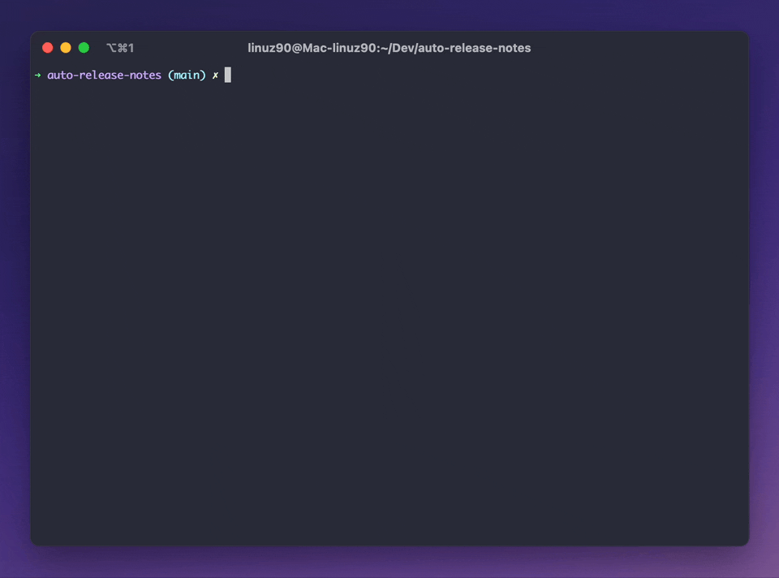

# Release Notes Generator

At [Typefully](https://typefully.com), we're often busy developing and don't spend much time communicating the work we do. That's why I created this Node.js script to **automatically generate release notes** for our completed Linear issues from the past week. 

It uses the [Linear](https://linear.app/), [OpenAI](https://beta.openai.com/), and [GitHub](https://github.com/) APIs to create a nicely formatted Markdown file with sections for **New Features**, **Improvements**, and **Fixes**.



## Setup

Install the required dependencies using yarn:

```bash
yarn install
```

Copy the `.env.template` file to a new file named `.env` and fill in the required environment variables:

```
cp .env.template .env
```

Open the .env file in your favorite text editor and replace the placeholder values with your actual Linear, OpenAI, and GitHub API keys.

- The **Linear** API is used to pull the completed issues for the chosen time range
- The **GitHub** API is used to understand if an issue has been merged
- The **OpenAI** API is used to generate the release notes

You need [GPT-4 access](https://openai.com/waitlist/gpt-4-api) to make best use of this script, since it doesn't seems to work well with any other model.

## Run the Script

Once you have set up the environment variables, simply run the script using yarn:

```
yarn start [timerange]
```

`timerange` is optional. It can be one of the following values:

* `last-7` (default)
* `curr-week`
* `prev-week`
* `curr-month`
* `prev-month`

The script will generate the release notes and save them in a file named `release-notes-[timerange].md` in the root of the project.

## Customize the Script

I recommend customizing the `getMergedIssues` function to suit your needs, for example filtering issues by project or label.